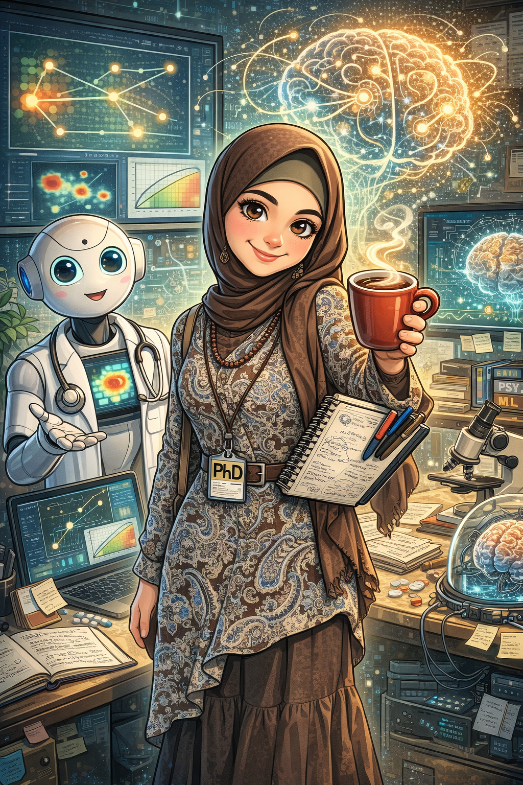

# 💫 Nilam El Amrani

<table>
  <tr>
    <td style="vertical-align: top; width: 70%;">

<em>
PhD Researcher in Robotics & Artificial Intelligence  
focused on Human-Centered AI, Healthcare Robotics, and Multimodal Intelligent Systems
</em>

---

## 🧠 About Me

I am a PhD student at ENSA Fes working on **hybrid AI–robotic systems for personalized assistance and monitoring in smart healthcare environments**.

My work focuses on combining:
- Robotics and control systems  
- Machine learning and deep learning  
- Cognitive and psychological modeling  
- Multimodal perception (vision, gaze, behavior, context)  
- Human-centered intelligent systems for healthcare  

---

## 🔬 Research Interests

- Human-centered and socially assistive robotics  
- Hybrid AI systems (symbolic + learning-based approaches)  
- Human–Robot Interaction (HRI)  
- Multimodal perception and behavioral modeling  
- Cognitive and affective state estimation  
- AI for healthcare monitoring and assistive systems  
- Ethical and trustworthy AI in real-world deployment  

---

  

  

  </tr>
</table>

---

## 🌐 Connect with me

---

## 💻 Technical Stack

### 🤖 Robotics & AI

### 💻 Programming

### 🧠 Data & AI Systems

### 🔧 Hardware & Tools

---

## 📊 GitHub Stats

## 📈 Contribution Activity

---

## 🔝 Contributions

- Robotics and AI system prototypes (ROS 2 based)  
- Multimodal behavioral and cognitive modeling pipelines  
- Computer vision and human interaction analysis tools  
- Experimental AI systems for healthcare applications  

---

## 📫 Contact

- LinkedIn: https://www.linkedin.com/in/nilam-el-amrani  
- Email: nilamelamrani@gmail.com  
- Medium: https://medium.com/@nilamelamrani  

---
